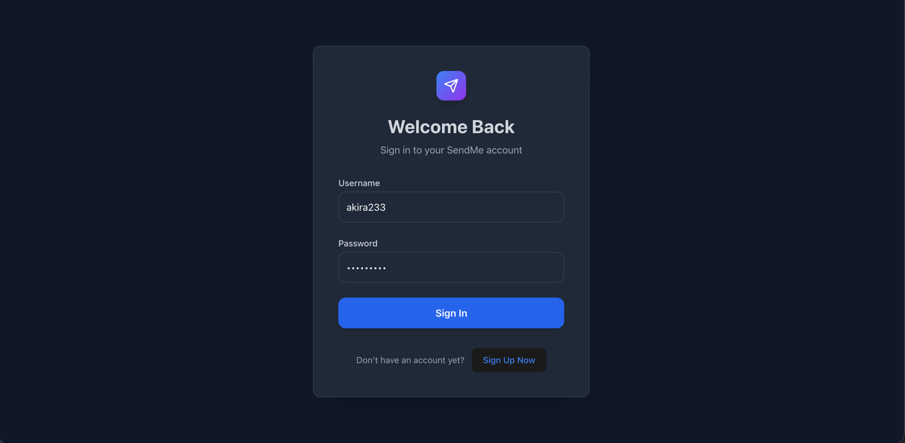
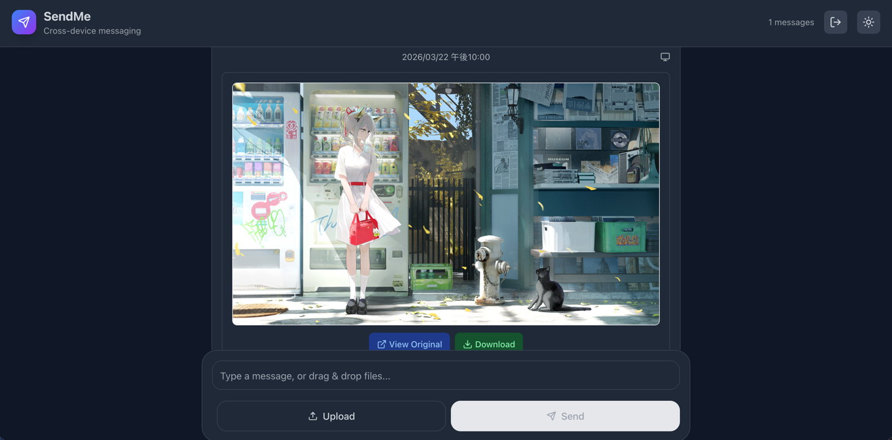
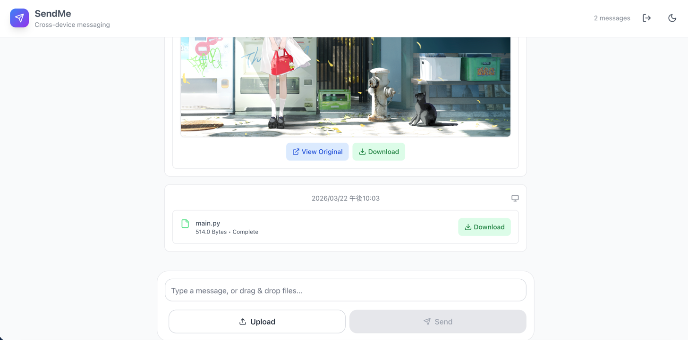

# SendMe

SendMe is a cross-device file and message transfer app that keeps your phone and desktop in sync. It focuses on quick
handoff: send a text or file on one device and see it on the other instantly.

## Screenshots

Place images in `docs/images/` and update paths below.





## Product Overview

SendMe solves a simple workflow: move small bits of content across devices without friction. It is optimized for quick
share, not long-term storage.

### Core Features

- Cross-device sync: one account across phone and desktop.
- Text messages: lightweight notes that appear instantly on all devices.
- File transfer: upload once, download or preview anywhere.
- Image preview: view images inline without downloading first.
- Realtime updates: WebSocket push with polling fallback.
- Automatic cleanup: messages and files expire after TTL to stay within capacity.

### Ideal Use Cases

- Send a link or snippet from phone to desktop.
- Move a PDF or image between devices quickly.
- Temporary handoff without cluttering long-term storage.

## Docs

- Product and usage: this README
- API reference: `docs/API.md`
- Technical details: `docs/TECHNICAL.md`

## Project Structure

```text
.
├── app/                        # FastAPI Backend Root
│   ├── api/                    # Route handlers (Auth, Messages, etc.)
│   ├── core/                   # Config, Security (JWT), & Dependencies
│   ├── schemas/                # Pydantic models (Data Validation)
│   ├── services/               # Business logic (OTP, File Processing)
│   ├── storage/                # Database models & Repository patterns
│   └── main.py                 # FastAPI app entry point
├── frontend/                   # React + TypeScript Web App
│   ├── src/
│   │   ├── components/         # Reusable UI components
│   │   ├── hooks/              # Custom React hooks (WS, Auth)
│   │   └── services/           # API client (Axios)
│   └── package.json
├── alembic/                    # Database migration scripts
├── tests/                      # Pytest suite for backend
├── docker-compose.yml          # Local & Production orchestration
└── Dockerfile                  # Multi-stage build for Backend
```

## 1. Quick Start (Docker)

### 1.1 Prerequisites

- Docker Desktop running
- Node.js 18+ (frontend local dev)

### 1.2 Start backend + infra

```bash
docker compose up -d db redis backend
```

Backend docs:

- Swagger UI: `http://0.0.0.0:8000/docs`
- OpenAPI JSON: `http://0.0.0.0:8000/openapi.json`

### 1.3 Start frontend

```bash
cd frontend
npm install
npm run dev -- --port 3000
```

## 2. Environment Variables

Main `.env` keys:

- `DATABASE_URL`
- `REDIS_URL`
- `SECRET_KEY`
- `MAX_FILE_SIZE`
- `UPLOAD_DIR`
- `RESEND_API_KEY`
- `RESEND_FROM_EMAIL`
- `SECRET_KEY`
- `UPLOAD_DIR`

Notes:

- Inside Docker backend, DB host should be `db`.
- On host scripts, DB/Redis host is usually `localhost`.

## 3. Migrations (Alembic)

```bash
alembic revision --autogenerate -m "your message"
alembic upgrade head
```

If host migration reports `could not translate host name "db"`:

- use a host DB URL (e.g. `localhost`) for that command, or
- run migration inside backend container.

## 4. API Overview

Base path: `/api/v1`

Auth:

- `POST /auth/request-otp`
- `POST /auth/register-with-otp`
- `POST /auth/login`
- `POST /auth/refresh`

Messages:

- `POST /messages/text`
- `GET /messages/history`
- `POST /messages/upload`
- `GET /messages/{message_id}/download`
- `GET /messages/{message_id}/view` (image only)
- `DELETE /messages/{message_id}`
- `WS /ws/messages?token=<access_token>` (real-time updates)

Detailed API doc: `docs/API.md`

## 5. Realtime Sync (WebSocket)

WebSocket endpoint:

- `WS /api/v1/ws/messages?token=<access_token>`

How it works:

- Login first to get `access_token`
- Frontend connects WS with token in query
- Backend pushes events when message changes:
    - `message.updated`
    - `message.deleted`
- Frontend receives event and refreshes history

Fallback strategy:

- If websocket disconnects, frontend falls back to 3-second polling
- When websocket reconnects, polling stops

## 6. Recommended End-to-End Flow

1. Request OTP: `POST /auth/request-otp`
2. Register with OTP: `POST /auth/register-with-otp`
3. Login to get access token: `POST /auth/login`
4. Open WebSocket for real-time sync: `WS /ws/messages?token=...`
5. Send text: `POST /messages/text`
6. Upload file/image: `POST /messages/upload`
7. Pull history: `GET /messages/history`
8. Download/view/delete by message id

## 7. TTL & Capacity

- `MESSAGE_TTL_SECONDS` (default `86400`) controls expiration.
- New messages are indexed in Redis for TTL cleanup.
- Background cleanup removes expired messages (including files) periodically.
- Capacity is tracked per user with `used_quota_bytes`.
- Frontend strategy:
    - Primary: WebSocket event-driven refresh
    - Fallback: polling every 3 seconds when WS disconnects

## 8. Testing

Backend (container):

```bash
docker compose run --rm backend pytest
```

Backend (host):

```bash
pytest
```

Frontend build check:

```bash
cd frontend
npm run build
```

## 9. Common Issues

- `401 Unauthorized` on `/messages/history` at startup:
    - clear stale `authToken` in localStorage and login again.
- Browser CORS error after request:
    - backend may actually be `500`; inspect backend logs first.
- OTP send returns `503`:
    - verify RESEND config and provider limits.

## 10. CI/CD (GitHub Actions)

### CI

- Workflow file: `.github/workflows/ci.yml`
- Trigger: push/pull request to `main` or `master`
- Jobs:
    - Backend tests: install Python dependencies and run `pytest -q`
    - Frontend build: run `npm ci` + `npm run build`

### CD

- Workflow file: `.github/workflows/cd.yml`
- Trigger: push to `main`/`master` (or manual dispatch)
- Jobs:
    - Build and push backend Docker image to GHCR:
        - `ghcr.io/<owner>/<repo>/backend`
        - tags include branch, commit SHA, and `latest` on default branch
    - Optional deploy webhook:
        - If `DEPLOY_WEBHOOK_URL` secret is configured, CD triggers it after image publish.

Required repository settings:

- Actions permissions: allow `GITHUB_TOKEN` to write packages (for GHCR push)
- Optional secret:
    - `DEPLOY_WEBHOOK_URL` (for Render/Railway/Fly/other webhook-based deployment)
